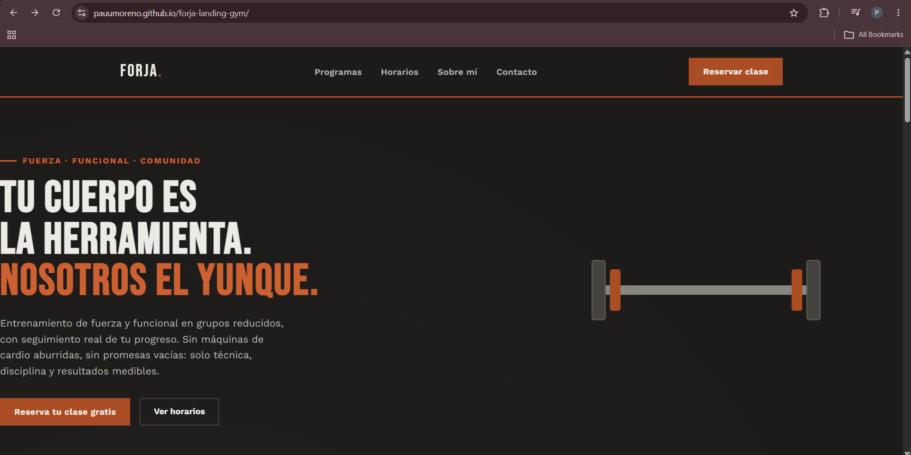

# Forja — Landing Page para Gimnasio

Landing page responsive para un gimnasio de entrenamiento de fuerza y funcional. Proyecto de portafolio creado para practicar diseño de UI, HTML semántico y CSS puro (sin frameworks).

## 🎯 Qué resuelve

Muchos negocios locales (gimnasios, talleres, peluquerías) no tienen presencia web o usan plantillas genéricas. Este proyecto muestra cómo construir una landing page a medida, con identidad visual propia, que cualquier pequeño negocio podría usar como sitio principal.

## 🛠️ Tecnologías

- HTML5 semántico
- CSS puro (Grid, Flexbox, variables CSS, animaciones con `prefers-reduced-motion`)
- JavaScript vanilla (scroll suave)
- Google Fonts (Bebas Neue, Work Sans, JetBrains Mono)
- 100% responsive (mobile-first breakpoints)

## ✨ Características

- Diseño con paleta e identidad propia (temática industrial: acero, óxido, cemento)
- Sección de estadísticas con visual de "discos de peso" hecho en SVG/CSS
- Grid de horarios semanales
- Accesibilidad: estados de foco visibles, movimiento reducido respetado
- Sin dependencias ni build step: un solo archivo HTML

## 🚀 Cómo verlo

Solo abre `index.html` en cualquier navegador. No requiere instalación ni servidor.

## 📌 Nota

Este es un proyecto de portafolio con contenido ficticio (negocio de ejemplo), creado para demostrar habilidades de desarrollo frontend. No representa un negocio real.

---

Desarrollado por [tu nombre] como parte de mi portafolio de desarrollo web.
